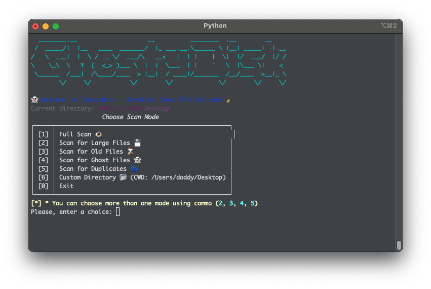
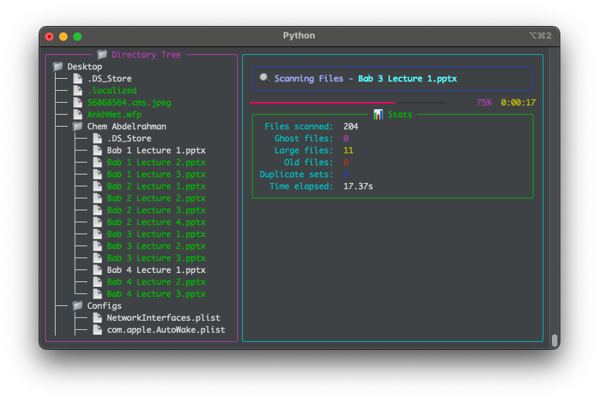
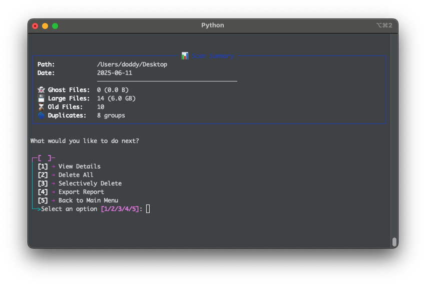
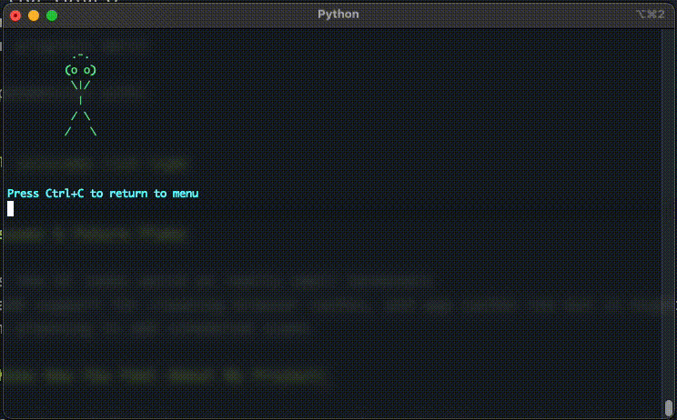

# 👻 GhostyDisk

*I think it is the first disk cleaner that won't destroy your dev environments!*

I made this project, because I am tired of disk cleaning, and never found a tool that is good on terminal with clean terminal ui, or that saves my development environments without touching!

## What's This All About?

GhostyDisk helps you to find and clean up your device easily by:

- **Ghost Files** 👻 - Those pesky .tmp, .bak, and .swp files that pile up and get forgotten
- **Large Files** 💾 - Find what's hogging your precious disk space (looking at you, downloaded movies...)
- **Old Files** ⌛ - Stuff you haven't touched in forever but forgot about
- **Duplicates** 🌀 - Identical files wasting space (why do I have four or five copies of that homework PDF??)

Unlike other disk cleaners that just nuke and mess with everything comes at hand, GhostyDisk is **SUPER CAREFUL** around dev envs - it won't destroy your node_modules, .git folders, or other important project files unless you yourself specifically tell the tool to do so!

## Screenshots

Here's what GhostyDisk looks like in action:

### Start Screen



### Full Scan



### Scan Results



### Ghost Animation



**Linux binary is located inside dist/ directory.**

## Why I Made This

In the first place I always needed a cleaning tool that doesn't mess with my dev environments, also that is clean and easy to use with fancy good looking UI, especially on terminal! And that is what made me do this in the first place.

Most disk cleaners I found were either:

1. Too aggressive (deleted important files of mine)
2. Too complicated to use most of the time or soo basic and simple
3. Looked like they were made in the 90s too when it comes to linux

So I built my own! And I learnt alot along the way on how to make the terminal stuff look cool.

## Features

- 🔥 **Cool Terminal UI** with fancy colors and animations
- 🛡️ **Dev-Friendly** - Won't destroy your coding projects! (default excludes common dev folders)
- 🔍 **Smart Detection** for most junk files
- 🔄 **Multiple Scan Modes** that you can run individually or combination of them
- 📊 **Visual Results** with stats and colorful displays too
- 🧹 **Selective Deletion** - choose exactly what to keep and what to remove
- 📝 **Export Options** - save results as TXT, JSON, or Md
- 🤖 **Command Line Mode** for whenever you might think of automating things

## How to Run It

```bash
# Just run it!
python ghostydisk.py

# Scan a specific folder
python ghostydisk.py --path ~/Downloads

# Use CLI options for specific scans
python ghostydisk.py --large 100 --old 90 --ghost

# Export results to a file
python ghostydisk.py --export cleanup_report

# Preview what would be deleted without actually deleting
python ghostydisk.py --dry-run

# Show all options
python ghostydisk.py --help
```

## Command Options


| Option                   | What it does                                              |
| ------------------------ | --------------------------------------------------------- |
| `--path PATH`            | Choose which folder to scan                               |
| `--large SIZE`           | Find files bigger than SIZE megabytes                     |
| `--old DAYS`             | Find files older than DAYS days                           |
| `--ghost`                | Look for temporary/backup files                           |
| `--no-dupes`             | Skip duplicate file scan                                  |
| `--dry-run`              | Just show what would be deleted (doesn't actually delete) |
| `--delete`               | Auto-delete without asking (be careful!)                  |
| `--export PATH`          | Save a report file                                        |
| `--hash-algo {md5,sha1}` | Choose hash algorithm for finding duplicates              |
| `--exclude PATTERN`      | Skip certain files/folders                                |

## The coder friend :)

GhostyDisk is probably the ONLY disk cleaner that's actually safe for developers maybe not very optimized yet but everything will be better in the right time. It automatically skips the following:

- `.git` folders (don't want to break your repos!)
- `node_modules` (even though they're huge, deleting them breaks projects)
- Virtual environments (`venv`, `.env`, etc.)
- Build directories
- IDE config folders (`.vscode`, `.idea`)
- And lots more!

Other cleaners just see large folders and delete them - then your projects break and you're stuck reinstalling everything 😭

## What You Need To Run It

- Python 3.6+
- colorama (for colors)
- rich (for the fancy UI)
- tqdm (for progress bars)

Install dependencies with:

```bash
pip install colorama rich tqdm
```

## Known Issues & Future Plans

- Sometimes the UI looks weird on really small terminals
- Need to add support for cleaning browser caches, and app caches too but it might take a few more time.
- Also I am planning to add scheduled scans

## Let Me Know How You Feel About My Project!

Feedback is welcomed! Feel free to open issues if you find bugs or have ideas for new features.

Made with ❤️ by Khaled Muhammad <3
